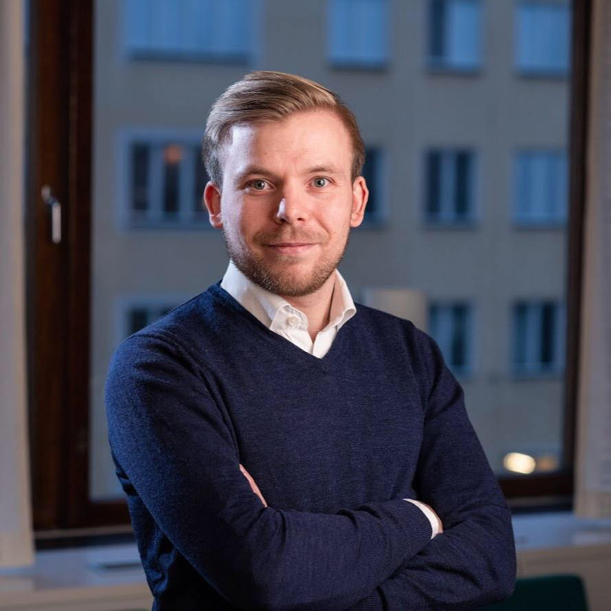

<!--Just basic texts with   to separate text chunks.-->

# About Me

 

 

I am a PhD Student at Luleå University of Technology. My main focus are impacts of Environmental Policy of Innovation and Competitiveness and I am currently looking at small and medium-sized enterprises in Norrbotten County, Sweden.

My dream is to leave a mark through my research while also striving to reach, and stay, at the frontier of economic research. I believe that one is never fully learned and I am always looking to broaden my mind through studies, research, work and travel.

My drive and work ethics has led me to both an internship at Ratio where I got to work on my first paper together with a post-doc researcher, but also led to a full time employment for three months at Luleå University of Technology during his last semester of his 1-year master. In addition to the experience I got from my positions in Sweden I also landed a scholarship allowing me to spend one year studying at the University of Toledo where I got the opportunity to further develop my knowledge and work on a second paper.

In addition to my work within the academic world I have been appreciated while doing my best to improve both the political world as well as local dementia units. After roughly 14 weeks of working with elder's I managed to land a summer job as a head of unit where I managed two different dementia units and got to take responsibility for everything from scheduling, budgeting and personnel. This was something that I got to do as a summer job during two summers while I studied at Luleå University of Technology. I also got recognized within the political sphere as I, after only 6 months of engagement, managed to reach the position as President of Swedish Young Conservatives in Norrbotten county. After one year of hard work as president combined with my studies I went on to take the role of Vice President of Moderate Students in Sweden. This was a role I held for a year before leaving the youth organization for studies in the U.S.